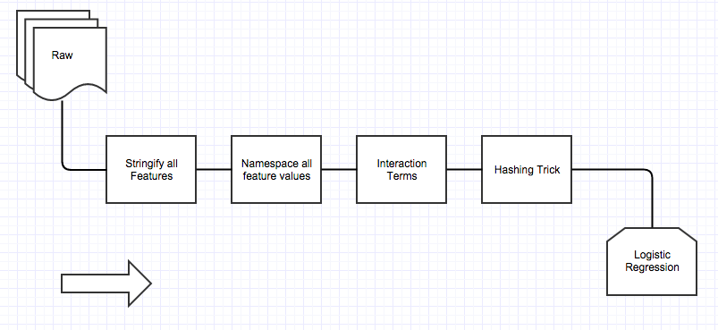

# adtech-dash-py
Tutorial for a small adtech classification model and monitoring system

### Purpose
Introduction to Machine Learning, Classification problems using basic techniques, as well as implementation of a monitoring system using standard Python tools.

+ Two-class classification problem (simplest classification case)
+ Out-of-core model (~fixed memory size for training and classifying)
+ Model ported around and used by other systems
+ Widely used classifier called Logisitic Regression
+ Data in Flat-file, needs preprocessing
+ Standard Python tools

We'll use standard analytics tools in `sklearn`, and web in `Flask`, `SQLite`/`PostgreSQL`.

### Dataset

+ Criteo Display Advertising Dataset [here](http://labs.criteo.com/downloads/2014-kaggle-display-advertising-challenge-dataset/)
+ Each observation is an ad: ~20 count features, ~20 categorical features, with Yes/No whether it was clicked
+ Classifier predicts Yes/No whether it was clicked
+ Class imbalance (Yes is ~2%)
+ Unknown high number of categories
+ 45 million observations
+ 12 GB

For feature engineering, classifier choice and classifier evaluation, we used techniques outlined in ["Simple and scalable response prediction for display advertising"](http://dl.acm.org/citation.cfm?id=2532128) by OLIVIER CHAPELLE at Criteo, EREN MANAVOGLU at Microsoft, ROMER ROSALES at LinkedIn.

### The Machine Learning Problem
Build an out-of-core (~fixed memory usage) system (a classifier) to predict, given features of an ad, Yes or No if it is/was clicked. Package to be loaded by other systems.

### The Monitoring System Problem
Implement a web based system to repeatedly compute evaluation metrics to tell how well the classifier is doing.

### Machine Learning Details

We use a simplified version of the method in the paper above. 

#### Model: Logistic Regression
##### Intro to logistic regression.

We have a two class classification problem. 

A Logistic Regression model is a parametric model (i.e., defined completely by a fixed set of numbers called `parameters`) that is trained specifically to calculate the probability, given the ad's features, that it will be clicked. In math, that's `Prob(class = YES| ad)`. This number is between 0 and 1. The model has a hyperparameter called a `threshold`. The classification works like this:
		
		if Prob(class = YES|ad) >= threshold:
			return YES
		else:
			return NO

Often the threshold is 0.5, but it can be any number between 0 and 1, adjusted to be more sensitive to False Positives or False Negatives.

The assumption of logistic regression is that we can simply take our list of parameters, mulitiply them by the ad's numberical features and add them together to get this probability.

Our goal in training the model is then to compute this list of parameters. The method used is called `Stochastic Gradient Descent`.

#### Feature Engineering
We consider all features as categorical of strings (including numerical features!).
We then namespace all values by prepending values with feature name. We then take all paired interaction terms (e.g. x, y -> x;x, x;y, y;x, y:y).
We then apply the "Hashing Trick": this turns an observation vector in to a bit vector. We use 24 bits here.

		def hashing_trick(vector v, hash_function h, int num_bits):
			result = array of 2 ** num_bits 0
			for each index j of v:
				i = absolute value of (h(v(j)) mod (2 ** num_bits))
				result[i] += 1
			return result
			
Note that the ads features will now be a sparse vector of `2**24 ~ 16M` features.

### Packaging the model
A model is not just a mathematical entity. It is a piece of software as well. It is also its preprocessing code. Roughly speaking a model (as a piece of software) consists of the following:

+ Software packages (versioned and their dependencies) used to train it
+ Training data
+ Source code

We must not only create a serializable model file, but also metadata files and a preprocessing library for our specific model.

Our goal is to package the model in a way that another system (e.g. our monitoring system) can consume it. A monitoring system would import a preprocessing module, a metadata file, and deserialize a copy of the model model.

### The Monitoring System:
We want a monitoring system that loads our model and implements the following API:
	
	POST /received_ads with
		params: { ad features }
		Posts an ad with its features, classifies it, then persists
	GET /recall with
		params: { since: timestamp, until: timestamp }
		Returns the recall scores each minute between since and until
		
We'll use a web application and back it with a relational database. We use `Flask` and `SQLite/PostgreSQL` and probabily deploy on Amazon Web Services or some other host.

Our database looks like this:

Table received_ads

	id * | received_at | true_label | text of features | pred_label

	create index on received_ads.received_at

View metrics on received_ads
	
	true_pos | true_neg | false_pos | false_neg | precision | recall | f_score

See if it takes a while. If so, we can create a table that materializes the result for each minute, with a query issued by recurrent process (e.g. a cron job).

If keeping all the post requests are an issue, we should break up the API into two distinct subsystems: 1. a persist queue (like `Kafka`) to store POST requests, and 2. a serving database to handle GET requests. We should eventually also repeatedly backup the serving database.

